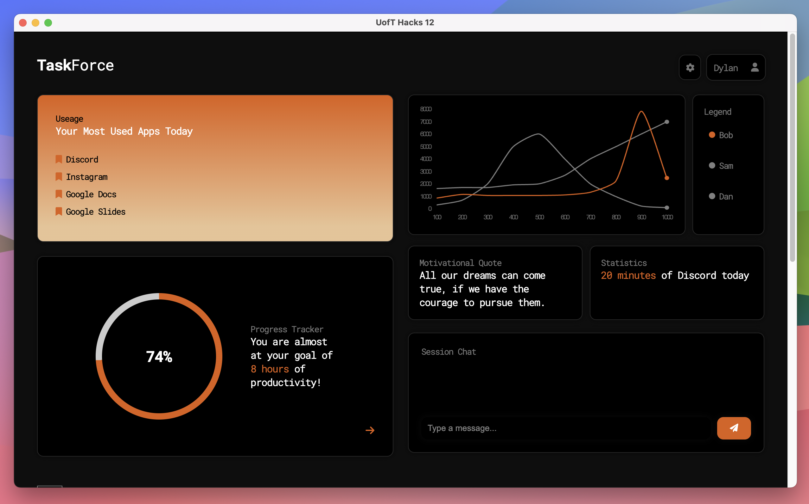
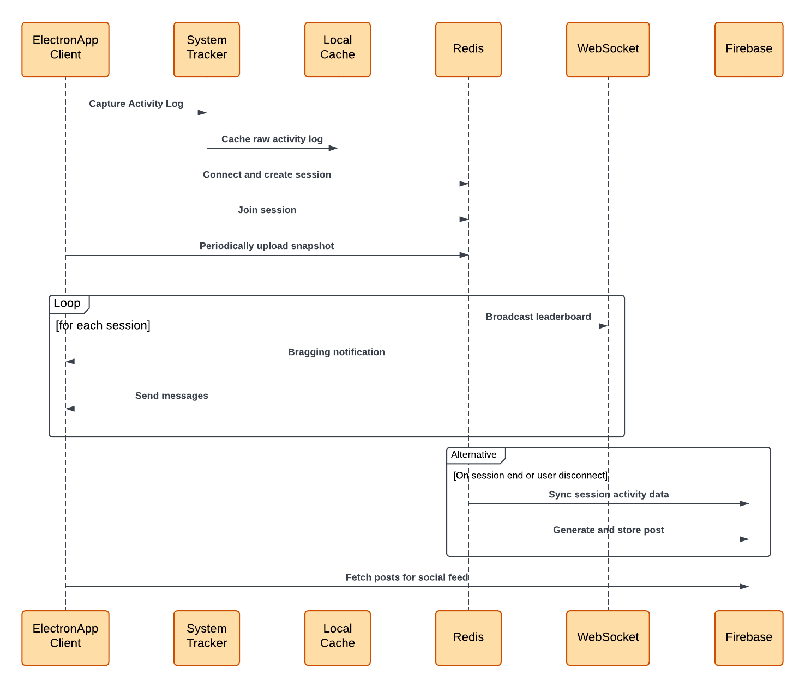

# Task Force

Ever gone on LinkedIn and all you saw was “I’m happy to share that I will be working at `{Google, Microsoft, Meta, Tesla, etc}` this summer”. You probably thought to yourself, _“Wow, I really have to start working harder.”_

That feeling – the urge to level up your own productivity – is a powerful motivator.We recognized this common experience and decided to harness it.

Introducing TaskForce, a **desktop app** designed to tackle procrastination head-on by reframing your perspective on productivity and accountability.

Now not only can you track your own productivity, but you can also see how your friends are doing, get motivated in real time, and roast each other using genAI.



Learn more about us on [DoraHacks](https://dorahacks.io/buidl/21726). This is a project submitted to UofTHacks 2025.

## Demo

View our demo video [here](https://drive.google.com/file/d/1G_SzCP5b483iR8ahEgtdpbvVVSRncAhD/view?usp=share_link).

## Tech Stack



## Features

- **Device Usage Tracking**: Monitor your device activity in real-time, including active apps and browser tabs, with intelligent classification of activities as productive or non-productive.

- **Real-Time Monitoring & Analytics**: Stay informed with real-time activity analytics and securely cache your activity logs on your device for privacy.

- **AI Roasting & Encouragement**: Receive AI-generated roasting messages and humorous encouragements to stay focused and motivated.

- **Personalized Productivity Insights**: Build your productivity profile, track progress over time, and sync session summaries to a database. Retrieve real-time updates about your friends' productivity and compare performance.

- **Focus Group Sessions**: Host or join focus sessions with friends. Receive notifications when others in the session are performing well, fostering mutual encouragement to stay focused.

- **AI-Generated Celebrations**: Share your achievements effortlessly with AI-generated celebratory posts, perfect for showcasing your progress on platforms like LinkedIn.

- **Productivity Nudges**: Stay on track with red warning glows and humorous, AI-generated roasting messages with audio alerts whenever your productivity slips.

## Usage

Task Force consists of the front-end client running on Electron and the back-end server running on Flask.

> We did not deploy the back-end server, so you can run it locally or deploy it yourself to allow your friends to connect.

### Electron App

```sh
cd frontend
npm install
npm start
```

This starts the electron app. You might need to approve a few privacy permissions in order for the system tracking to work.

### Flask Server

The backend server is supposed to be deployed on a cloud service like Heroku or AWS. You can also run it locally but other clients will not be able to connect to it (unless you expose your local server to the internet).

```sh
cd backend
pip install -r requirements.txt
python run.py
```

This runs the flask server. You will require a `.env` file to setup auth0, firebase, and GenAI.

If you are running this locally, you must initialize a Redis server:

```sh
# if you have redis installed
redis-server
# or if you are using docker
docker run -d -p 6379:6379 redis

# check the server is running
redis-cli ping # should return PONG
```

## Team

- [Jet Chiang](www.linkedin.com/in/jet-chiang), Engineering Science 2T8 @ University of Toronto

- [Chi McIssac](https://www.linkedin.com/in/chimcisaac/), CS @ Carleton University

- [Nicholas Ching](https://www.linkedin.com/in/n-ching/), Engineering @ McMaster University

- [Dylan Li](https://www.linkedin.com/in/dylanliwu/), Engineering @ McMaster University
